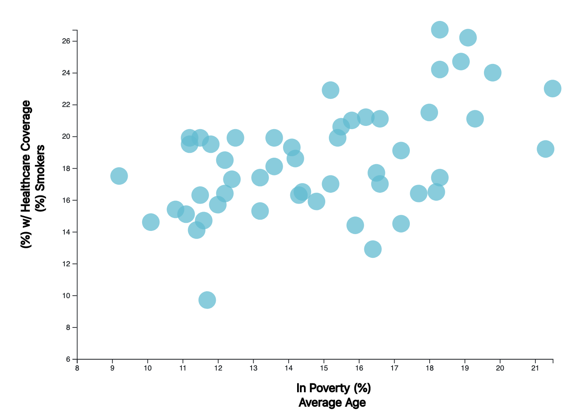

# D3_Challenge
## Repository Table of Contents
* D3_data_journalism: This folder contains the html, javascript, csv and css files used to complete the mandatory piece to this exercise.
* D3_data_journalism_bonus_1: This folder contains my attempt to complete the first bonus piece to this exercise. The file layout in this directory is the same as above.
* images: This folder contains screenshots that are displayed in the README.
### Primary Exercise
In this exercise, I used d3 to visualize data from the US Census Bureau to determine correlations between health risks and demographic factors. In particular, I looked at smoking as compaired to the poverty rate in each of the 50 US states. I have included a screenshot of that visualization below.

In addition to comparing the percentage of those that smoked to the percentage of those living in poverty, I included the average income which is used to determine th bubble size. The higher average income, the larger the bubble and vice versa. When viewed like this, it is quite easy to see that those living in poverty and making a lower average income are more likely to use tobacco products.

### Bonus 1
In this part of the exercise I attempted to add different labels to the x axis that could be used to transition between different comparisons. I was able to get pieces of this working, but I could not figure out how to do this and keep the labels inside the bubbles. Unfortunately, I do not have time right now to focus on this due to family priorities, but I included it here so I can continue to work on this at a later time. Below are screenshots of what I was able to get to work. The first screenshot is of the image shown above (without the labels), and it will transition into the next image which compares % smokers to average age once the user selects.

